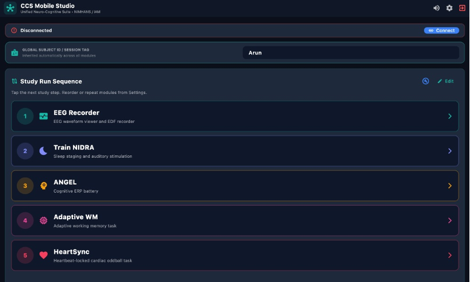
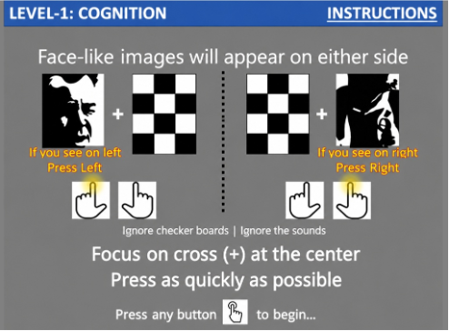
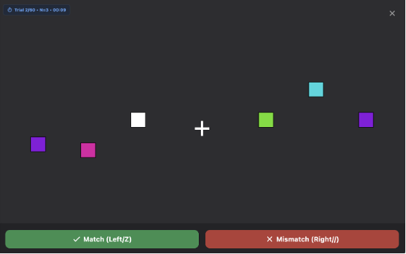

<div align="center">

# CCS Mobile Studio

### One workspace for neurophysiology acquisition, stimulation and cognitive experiments

[](https://github.com/arunsasidharan84/CCS_MobileStudio/releases)
[](https://flutter.dev)
[](rust/)
[](#installation-and-updates)

Developed by the **Centre for Consciousness Studies (CCS)**, Department of
Neurophysiology, **NIMHANS**, Bengaluru, India.

[Download the latest release](https://github.com/arunsasidharan84/CCS_MobileStudio/releases/latest) · [Explore the modules](#research-modules) · [Build from source](#building-from-source)



</div>

CCS Mobile Studio brings live EEG/fNIRS acquisition, sleep staging, ERP
experiments, adaptive cognition tasks and synchronized stimulation into one
subject-session-aware application. Flutter provides a consistent interface
across Android, macOS and Windows, while a native Rust core handles real-time
signal processing, ONNX inference and standards-compliant EDF writing.

> Enter the participant identifier once, connect the acquisition hardware and
> move through the complete study sequence without changing applications or
> manually reconciling filenames.

## Highlights

| Acquire | Experiment | Analyse & safeguard |
|---|---|---|
| Multi-device EEG, ECG, PPG and fNIRS streaming | Train NIDRA, ANGEL, Conventional ERP, Adaptive WM and HeartSync | Live signal quality, ERP averages and sleep staging |
| Full-screen configurable waveforms and live markers | Bundled or researcher-supplied visual/audio stimuli | Timestamped, calibrated EDF with reconnect-safe segments |
| BLE, Bluetooth Classic and LSL profiles | Configurable marker profiles and study ordering | In-app, checksum-verified release updates |

---

## About

Research protocols at CCS/NIMHANS typically run several EEG- and fNIRS-based tasks back-to-back on the same subject: an EEG/fNIRS quality check, a sleep session (Train NIDRA), a cognitive ERP battery (ANGEL), an adaptive working-memory task, and a Stanford Sleepiness Scale check-in. CCS Mobile Studio replaces the need to juggle separate apps for each step. A single **Subject ID** is entered once and inherited across every module, a **Study Run Sequence** panel on the home screen walks the experimenter through the protocol in order, and every module writes to disk using the same naming scheme and export location — so a full study session produces a consistently organized dataset with no manual bookkeeping.

The app talks to hardware over **Bluetooth LE** (EEG amplifier) and **WiFi via Lab Streaming Layer / LSL** (fNIRS), and does the heavy numerical work — biquad filtering, real-time ONNX sleep-stage inference, and EDF encoding — in a native Rust library rather than in Dart, keeping the UI responsive at 60 fps while data streams in.

---

## Research Modules

### 1. Standalone EEG / fNIRS Recorder
The shared viewing-and-recording engine used by every other module, also available on its own as a general-purpose utility.
* Live multi-channel EEG waveform viewer with autoscale/fixed gain, signal-specific EEG/EOG/EMG display filters, and configurable channel-reference montages (raw, unfiltered data is still what gets written to disk).
* Real-time signal-quality metrics: peak-to-peak amplitude, artifact ratio, sensor stability.
* fNIRS viewer (HbO / HbR / HbT traces) for WiFi-connected NIRS devices such as NIRSport 2 / EpiDome.
* Direct-to-EDF recording via the native Rust writer, with automatic segment rollover (`_part2`, `_part3`, …) across BLE reconnects.

### 2. Train NIDRA — Sleep Staging & Auditory Stimulation
* Real-time sleep staging powered by a **TinySleepNet** ONNX model, run natively in Rust (`tract-onnx`) and fed frontal-channel EEG through a background Dart Isolate so scoring never blocks the UI.
* 30-second epoch classification into Wake / N1 / N2 / N3 / REM with per-stage confidence and spectral band powers (Delta, Theta, Alpha, Beta).
* Interactive hypnogram and live spectral visualization.
* **Auditory Closed-Loop Stimulation (ACLS):** when a target sleep stage (e.g. N2/N3 slow-wave sleep) is stably detected above a confidence threshold, the module triggers periodic acoustic stimulation — supporting slow-wave enhancement and lucid-dreaming stimulation protocols.

### 3. ANGEL — Cognitive ERP Battery
* Runs the CCS EEG ANGEL v2 event-related-potential paradigm, with **Level 2** and **Level 3** E-Prime-derived stimulus templates bundled as assets.
* Full **multilingual support** — English, Hindi, and Kannada stimulus sets.
* Automatic **PDF summary report** generation per session: overall and block-wise accuracy and reaction time, with dual field-mapping (`accuracy`/`correct`, `rt`/`rt_ms`) for robustness across trial formats.

### 4. Conventional ERP Laboratory
* Flexible visual/auditory oddball, N400, P50, MMN and N170 paradigms.
* Configurable standard/target stimuli, event codes, probability, timing and trial count.
* Live baseline-corrected ERP averaging with component-specific analysis windows.

### 5. Adaptive WM — Working Memory Task
* Adaptive working-memory paradigm with its own trial runner and stimulus renderer.
* Generates a PDF working-memory summary report on completion, mirroring the ANGEL reporting workflow.

### 6. HeartSync — Cardiac-Phase Oddball
* Heartbeat-locked stimulus delivery from live PPG or ECG with recorded timing diagnostics.
* Replay support for validating cardiac detection and stimulus scheduling from offline CSV data.
* Trial, phase-distribution and average cardiac-cycle exports for post-hoc analysis.

### 7. Sleepiness Scale
* Standalone Stanford Sleepiness Scale (SSS) assessment, intentionally decoupled from ANGEL/WM so it can be administered at any point in a protocol — before a nap, after a task block, at the start or end of a session — without being tied to a specific task module.

## Interface Gallery

| ANGEL multilingual instructions | Adaptive working-memory trial |
|---|---|
|  |  |

---

## Cross-Module Platform Features

* **Global Subject ID / Session Tag** — entered once on the home screen, inherited automatically by every module.
* **Study Run Sequence** — a reorderable, tappable checklist of the protocol steps for the current session, with per-step launch and a live "recording in progress" banner showing the active module and segment number.
* **Unified Connection Status Bar** — shows BLE EEG and WiFi fNIRS connection state, active device/stream name, and one-tap disconnect/reconnect, visible from every module.
* **BLE Streaming Coordinator** — enforces exclusive access to the EEG amplifier so two modules can never contend for the same Bluetooth stream.
* **Session Manager** — tracks session timestamp, subject, active module, and segment index; automatically closes and re-opens EDF segments across disconnect/reconnect events and exports finished recordings to `Downloads/CCS_MobileStudio`.
* **Standardized File Naming** — every exported file follows `<subject>_<MODULE>_<yyyyMMdd_HHmmss>[_partN].<ext>`, where `MODULE` is one of `NIDRA`, `ANGEL`, `WM`, `EEG`, or `SSS`.
* **Diagnostics & Troubleshooting Drawer** — per-session tools to test the audio beep/ACLS speaker path, verify the LSL multicast lock (required for WiFi stream discovery on Android 10+), and check the export location, without restarting the app.
* **In-App Updates** — the update button in the dashboard checks GitHub release metadata over HTTPS, selects the correct platform package, verifies its published SHA-256 digest when available, and starts the OS installation flow. Active recordings must be stopped first.

---

## Architecture

* **Frontend:** Flutter (Dart), Material 3, `provider` for state management. UI logic lives under `lib/modules/*` (one directory per module) with shared acquisition, device, and UI code under `lib/core/*`.
* **Native core:** a Rust crate (`train_nidra_core`, in `rust/`) compiled to a shared library per Android ABI (`arm64-v8a`, `armeabi-v7a`, `x86_64`) and loaded through `dart:ffi`. It owns:
  * Real-time TinySleepNet ONNX inference (via `tract-onnx`) for sleep staging.
  * EDF file writing (`tn_edf_open`, `tn_edf_push_sample`, `tn_edf_close`, plus label/range-aware variants), shared by both the EEG and fNIRS recorders.
* **Acquisition:** `flutter_blue_plus` / `flutter_bluetooth_serial` for the BLE EEG amplifier (xAMP-L10), and `liblsl` for WiFi-based fNIRS streaming (Lab Streaming Layer).
* **Reporting:** `pdf` / `printing` packages generate ANGEL and Adaptive WM summary reports on-device.

```
lib/
├── core/
│   ├── eeg/        # acquisition, EDF/fNIRS recorders, display filters, native FFI bridge
│   ├── models/      # EEG/fNIRS samples, sleep scores, module types, LSL config
│   ├── services/    # BLE coordination, session, settings, permissions, file naming
│   └── widgets/     # waveform painters, EEG/fNIRS viewer, connection status bar
├── modules/
│   ├── home/        # unified dashboard & study sequence
│   ├── standalone/  # EEG/fNIRS recorder & viewer
│   ├── nidra/        # Train NIDRA: sleep pipeline, ACLS
│   ├── angel/        # ANGEL ERP battery, trial models, PDF reports
│   ├── generic_erp/  # conventional ERP paradigms and live averaging
│   ├── adaptive_wm/  # Adaptive WM task, trial runner, PDF reports
│   ├── heartsync/    # cardiac-phase detection, task and replay tools
│   ├── sleepiness/   # Stanford Sleepiness Scale
│   └── settings/     # global settings & channel configuration
└── main.dart

rust/                 # native FFI core (ONNX inference + EDF writer)
assets/
├── models/            # TinySleepNet ONNX models (NIDRA)
└── EPrimeFiles/        # ANGEL v2 Level 2 & 3 stimulus templates (EN/HI/KN)
```

---

## Installation and Updates

Download the package for your operating system from
[GitHub Releases](https://github.com/arunsasidharan84/CCS_MobileStudio/releases/latest):

| Platform | Release package | Update behavior |
|---|---|---|
| Android | `CCS-Mobile-Studio-…-Android.apk` | Opens Android's package installer for confirmation |
| macOS | `CCS-Mobile-Studio-…-macOS-universal.zip` | Replaces the current app safely and relaunches; falls back to Finder if permissions prevent replacement |
| Windows | `CCS-Mobile-Studio-…-Windows-x64.zip` | Stages the replacement after exit and relaunches; falls back to Explorer if permissions prevent replacement |

Inside the app, select the **Update** icon in the upper-right dashboard toolbar.
The current release remains untouched until the new package has downloaded and
passed verification.

## Building from Source

### Prerequisites

* [Flutter SDK](https://docs.flutter.dev/get-started/install) (Dart SDK `^3.11.5`)
* [Rust toolchain](https://www.rust-lang.org/tools/install) (`cargo`)
* Android SDK + NDK for Android builds (the bundled `rust/build_android.sh` defaults to NDK `28.2.13676358`; override via `ANDROID_SDK_ROOT` / `NDK_HOME` / `ANDROID_API` env vars)
* Xcode for macOS builds, or Visual Studio 2022 with Desktop development with C++ for Windows builds

## Building the Native Core

Compile the Rust library for all Android ABIs and drop the outputs into `android/app/src/main/jniLibs/`:

```sh
./rust/build_android.sh
```

Desktop builds compile and package the Rust core automatically. The macOS
runner calls `rust/build_macos.sh` to create a universal Apple Silicon/Intel
dynamic library; Windows builds the x64 DLL through CMake.

## Replaying and Optimizing Sleep Scoring

`tools/optimize_sleep_scoring.py` reads calibrated EDF data in bounded chunks,
replays it as a causal stream, and compares the bundled models and EEG
derivations against a scored JSON benchmark:

```sh
python3 tools/optimize_sleep_scoring.py optimize recording.edf scoring.json
python3 tools/optimize_sleep_scoring.py replay recording.edf \
  --model assets/models/tinysleepnet-supratak/model.onnx \
  --derivation C3-M1
```

Install its Python dependencies with `numpy scipy scikit-learn pyedflib
onnxruntime`. The optimizer uses a chronological 70/30 selection/validation
split, keeps excluded/inconclusive labels in their original epoch positions,
and writes the complete candidate metrics to
`build/sleep_scoring_optimization.json`. For legacy xAMP recordings saved
before the 100× front-end calibration fix, add `--signal-scale 0.01`; this
cannot recover samples that were already clipped at the EDF physical limits.

### Running the App

```sh
flutter pub get
flutter run
```

### Building a Release APK

```sh
flutter build apk --release
```

### Building Desktop Releases

Run the command on the matching host operating system:

```sh
# macOS (produces build/macos/Build/Products/Release/ccs_mobile_studio.app)
flutter build macos --release

# Windows (produces build/windows/x64/runner/Release/)
flutter build windows --release
```

BLE, LSL, recording, sleep staging, audio stimulation, experiments, reports,
and import/export are available on desktop. Bluetooth Classic profiles remain
Android-only because the existing Classic plugin is Android-specific; the
shipped device profiles use BLE or LSL and work across all three platforms.

Choose the operator-visible save location under **Settings → Output & Study
Flow → Output Folder**. Exports are organized below it as
`<subject>/<session>/`. The same settings page controls whether ANGEL,
Adaptive WM, and HeartSync save connected physiological streams. ANGEL and
Adaptive WM can run task-only while continuing to save behavioral logs and
reports. During acquisition HeartSync requires live PPG or ECG for cardiac
timing even when continuous physiological saving is disabled. For algorithm
testing without a device, HeartSync also has **Replay CSV** input. A replay
file needs a
`timestamp`, `timestamp_utc`, `time`, or `seconds` column and a `PPG`, `ECG`,
`value`, or `signal` column; it may contain both `PPG` and `ECG` and an optional
`marker` column. Replay uses recorded timing and the same online detector as a
live run.

HeartSync's optional live plot shows the cleaned PPG and/or ECG, detected-beat
lines, and stimulus/response markers. Its completion plot shows average
peak-to-peak cardiac cycles with separate post-hoc marker-phase distributions.
The trial CSV and summary JSON include detection, timer-dispatch, and audio
command latency measurements so timing errors can be diagnosed separately.

The `Desktop release builds` GitHub Actions workflow runs whenever the version
in `pubspec.yaml` is changed on `main` and can also be started manually. It
builds macOS universal, Windows x64 and Android packages, then publishes them
under a versioned GitHub Release consumed by the in-app updater.

Published Android builds must always use the same signing identity so Android
can install a newer APK over an existing version. Configure the repository
secrets `ANDROID_KEYSTORE_BASE64`, `ANDROID_KEYSTORE_PASSWORD`,
`ANDROID_KEY_ALIAS`, and `ANDROID_KEY_PASSWORD`. Local release builds fall back
to the debug key for development only and should not be distributed.

---

## Hardware Supported

| Signal | Device (example) | Transport |
|---|---|---|
| EEG | xAMP-L10 | Bluetooth LE |
| fNIRS | EpiDome / NIRSport 2 | WiFi (LSL) |

---

## Repository Notes

* `rust/target/` (Cargo build cache) is intentionally excluded from version control via `.gitignore` — always rebuild locally with `rust/build_android.sh` or `cargo build` rather than expecting compiled artifacts in git history.
* Compiled `.so` files under `android/app/src/main/jniLibs/` **are** tracked, since they're the final artifacts the Android build consumes; regenerate them with `rust/build_android.sh` after any change under `rust/src/`.
