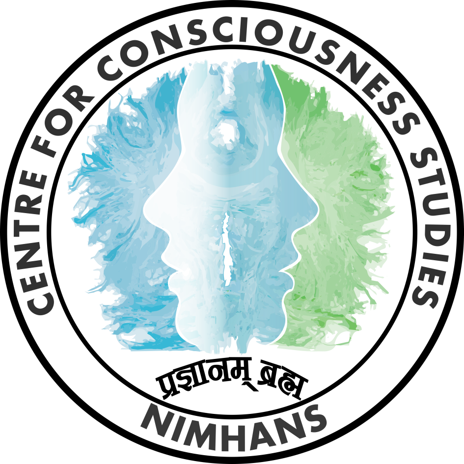
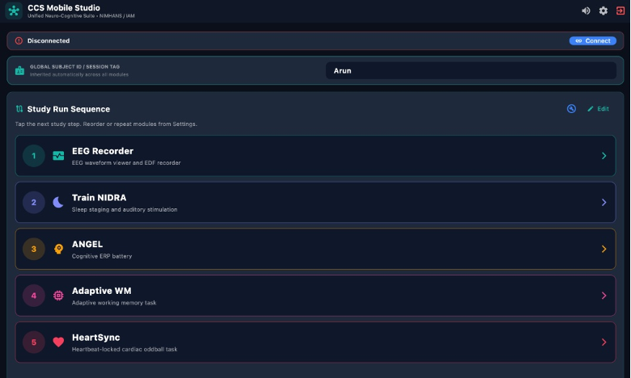
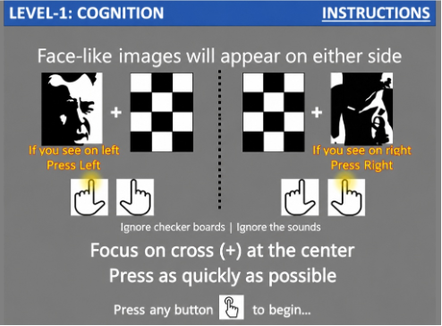
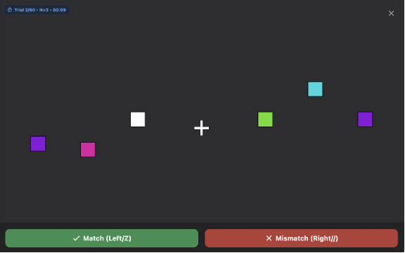

<p align="center">
  
</p>

<h1 align="center">CCS Mobile Studio</h1>

<p align="center">
  <b>One workspace for neurophysiology acquisition, stimulation and cognitive experiments</b>
</p>

<p align="center">
  A Research & Engineering Collaboration of<br>
  <b>Centre for Consciousness Studies (CCS)</b>, Department of Neurophysiology,<br>
  <b>National Institute of Mental Health and Neurosciences (NIMHANS)</b>, Bengaluru, India<br>
  🤝<br>
  <a href="https://axxonet.com/"><b>Axxonet</b></a> &nbsp;|&nbsp; <a href="https://www.neuro-stellar.com/"><b>Neurostellar</b></a>
</p>

<p align="center">
  <a href="https://github.com/arunsasidharan84/CCS_MobileStudio/releases/latest"></a>
  <a href="https://github.com/arunsasidharan84/CCS_MobileStudio/actions/workflows/desktop-release.yml"></a>
  <a href="https://github.com/arunsasidharan84/CCS_MobileStudio/releases"></a>
</p>

<p align="center">
  <b>Current version: 1.0.8</b> ·
  <a href="RELEASE_NOTES.md">Detailed changelog</a> ·
  <a href="https://github.com/arunsasidharan84/CCS_MobileStudio/issues">Report a problem</a>
</p>

<p align="center">
  <a href="#-quick-download"><b>📥 Download App</b></a> &nbsp;•&nbsp;
  <a href="#about"><b>About</b></a> &nbsp;•&nbsp;
  <a href="#-research-modules"><b>Research Modules</b></a> &nbsp;•&nbsp;
  <a href="#-building-from-source"><b>Build from Source</b></a> &nbsp;•&nbsp;
  <a href="RELEASE_NOTES.md"><b>Release Notes</b></a> &nbsp;•&nbsp;
  <a href="https://github.com/arunsasidharan84/CCS_MobileStudio/issues"><b>Report Issue</b></a>
</p>

---

### 📥 Quick Download

Pre-built standalone application packages are published automatically through GitHub Releases:

| Platform | Package Type | Extracted App / Binary | Direct Download Link |
| :--- | :--- | :--- | :--- |
| **macOS** | Universal desktop application (.zip) | **`CCS Mobile Studio.app`** | [CCSMobileStudio-macos.zip](https://github.com/arunsasidharan84/CCS_MobileStudio/releases/latest/download/CCSMobileStudio-macos.zip) |
| **Windows** | 64-bit desktop package (.zip) | `CCSMobileStudio.exe` | [CCSMobileStudio-Windows.zip](https://github.com/arunsasidharan84/CCS_MobileStudio/releases/latest/download/CCSMobileStudio-Windows.zip) |
| **Android** | Mobile & Tablet APK | `CCSMobileStudio-Android.apk` | [CCSMobileStudio-Android.apk](https://github.com/arunsasidharan84/CCS_MobileStudio/releases/latest/download/CCSMobileStudio-Android.apk) |

> 📦 **All Releases & Assets:** View all version packages, assets, and SHA-256 checksums on the **[GitHub Releases Page](https://github.com/arunsasidharan84/CCS_MobileStudio/releases/latest)**.  
> 🔄 **In-App Upgrades:** CCS Mobile Studio features automatic background update checks with SHA-256 verification via the **Update** icon in the dashboard toolbar.

#### 🍏 First-Time Launch for macOS Users (Gatekeeper Setup)

When extracting `CCSMobileStudio-macos.zip`, macOS extracts **`CCS Mobile Studio.app`** into your `~/Downloads` folder. Because development builds are ad-hoc signed, macOS Gatekeeper blocks opening them by default.

To enable the app, run the following in **Terminal**:

```sh
# 1. Clear Gatekeeper quarantine on the downloaded app:
xattr -rd com.apple.quarantine ~/Downloads/CCS\ Mobile\ Studio.app

# 2. Move to Applications folder:
mv ~/Downloads/CCS\ Mobile\ Studio.app /Applications/
```

> **Tip (Finder alternative):** In Finder, **Right-click (or Control-click)** `CCS Mobile Studio.app` → select **Open** → click **Open** on the security confirmation prompt. You only need to do this once.
>
> **Automated 1-Click Install:** Downloaded `.zip` archives can also be installed directly to `/Applications` without Gatekeeper prompts using `./tools/install_mac.sh`. Future in-app updates perform this automatically in the background.

<p align="center">
  
</p>

---

## About

**CCS Mobile Studio** brings live EEG/fNIRS acquisition, sleep staging, ERP experiments, adaptive cognition tasks, and synchronized stimulation into one unified, subject-session-aware application. Flutter provides a consistent, responsive interface across Android, macOS, and Windows, while a native Rust core handles real-time signal processing, ONNX inference, and standards-compliant EDF writing.

> Enter the participant identifier once, connect the acquisition hardware, and move through the complete study sequence without changing applications or manually reconciling filenames.

Research protocols at CCS/NIMHANS typically run several EEG- and fNIRS-based tasks back-to-back on the same subject: an EEG/fNIRS quality check, a sleep session (Train NIDRA), a cognitive ERP battery (ANGEL), an adaptive working-memory task, and a Stanford Sleepiness Scale check-in. CCS Mobile Studio eliminates the need to juggle separate apps for each step. A single **Subject ID** is entered once and inherited across every module, a **Study Run Sequence** panel on the home screen walks the experimenter through the protocol in order, and every module writes to disk using the same naming scheme and export location — so a full study session produces a consistently organized dataset with zero manual bookkeeping.

The app communicates with hardware over **Bluetooth LE** (EEG amplifiers) and **WiFi via Lab Streaming Layer / LSL** (fNIRS), delegating intensive numerical workloads — biquad filtering, real-time ONNX sleep-stage inference, and EDF encoding — to a native Rust library to maintain a fluid 60 FPS UI while high-density telemetry streams in.

---

## 🌟 Highlights

| Acquire | Experiment | Analyse & Safeguard |
| :--- | :--- | :--- |
| Multi-device EEG, ECG, PPG and fNIRS streaming | Train NIDRA, ANGEL, Conventional ERP, Adaptive WM and HeartSync | Live signal quality, ERP averages and sleep staging |
| Full-screen configurable waveforms and live markers | Bundled or researcher-supplied visual/audio stimuli | Timestamped, calibrated EDF with reconnect-safe segments |
| BLE, Bluetooth Classic and LSL profiles | Configurable marker profiles and study ordering | In-app, checksum-verified release updates |

---

## 🔬 Research Modules

### 1. Standalone EEG / fNIRS Recorder
The shared viewing-and-recording engine used by every other module, also available on its own as a general-purpose utility.
* Live multi-channel EEG waveform viewer with autoscale/fixed gain, signal-specific EEG/EOG/EMG display filters, and configurable channel-reference montages (raw, unfiltered data is still what gets written to disk).
* Real-time signal-quality metrics: peak-to-peak amplitude, artifact ratio, sensor stability.
* fNIRS viewer (HbO / HbR / HbT traces) for WiFi-connected NIRS devices such as NIRSport 2 / EpiDome.
* Direct-to-EDF recording via the native Rust writer, with automatic segment rollover (`_part2`, `_part3`, …) across BLE reconnects.

### 2. Train NIDRA — Sleep Staging & Auditory Stimulation
* Real-time sleep staging powered by a **TinySleepNet** ONNX model, run natively in Rust (`tract-onnx`) and fed frontal-channel EEG through a background Dart Isolate so scoring never blocks the UI.
* **Leads-Off & Amplitude Gating:** real-time physiological amplitude validation (`< 2.5 µV` or `> 400 µV`) detects flatline / disconnected electrodes, flagging epochs as `LEADS OFF` with 0% confidence and preventing false REM classifications.
* **Full Multi-Channel EDF Saving:** records all configured and connected hardware channels with authentic channel labels (e.g. `Fp1`, `Fp2`, `C3`, `C4`), 250 Hz sampling rate, and physical range calibrations across all session segments.
* **Spurious Noise Suppression:** selectable 20 Hz and 50 Hz notch filters for clean spectral and time-domain analysis.
* 30-second epoch classification into Wake / N1 / N2 / N3 / REM with per-stage confidence and spectral band powers (Delta, Theta, Alpha, Beta).
* Interactive hypnogram and live spectral visualization.
* **Synchronized Event Markers:** stimulus presentations (manual or automated) are recorded synchronously in both the EDF annotation track and the companion session CSV marker log.
* **ACLS Stimulus Sound Library & Playlist:** load custom audio cues or entire folders (`.wav`, `.mp3`, `.ogg`, `.flac`), toggle sequential or randomized playback, reorder the cue queue on the fly, assign per-cue trigger codes, and instantly cancel playback with the `■ STOP AUDIO PLAYBACK` control.
* **Auditory Closed-Loop Stimulation (ACLS):** when a target sleep stage (e.g. N2/N3 slow-wave sleep) is stably detected above a confidence threshold, the module triggers periodic acoustic stimulation — supporting slow-wave enhancement and lucid-dreaming stimulation protocols.

### 3. ANGEL — Cognitive ERP Battery
* Runs the CCS EEG ANGEL v2 event-related-potential paradigm, with **Level 2** and **Level 3** E-Prime-derived stimulus templates bundled as assets.
* Full **multilingual support** — English, Hindi, and Kannada stimulus sets.
* Automatic **PDF summary report** generation per session: overall and block-wise accuracy and reaction time, with dual field-mapping (`accuracy`/`correct`, `rt`/`rt_ms`) for robustness across trial formats.

### 4. Conventional ERP Laboratory
* Flexible visual/auditory oddball, N400, P50, MMN and N170 paradigms.
* Configurable standard/target stimuli, event codes, probability, timing and trial count.
* Live baseline-corrected ERP averaging with component-specific analysis windows.

### 5. Adaptive WM — Working Memory Task
* Adaptive working-memory paradigm with its own trial runner and stimulus renderer.
* Generates a PDF working-memory summary report on completion, mirroring the ANGEL reporting workflow.

### 6. HeartSync — Cardiac-Phase Oddball
* Heartbeat-locked stimulus delivery from live PPG or ECG with recorded timing diagnostics.
* Replay support for validating cardiac detection and stimulus scheduling from offline CSV data.
* Trial, phase-distribution and average cardiac-cycle exports for post-hoc analysis.

### 7. Heart Rate Detection — Bayesian Psi
* Interoceptive rate comparison using xAMP-L10 ECG or Orbit PPG, with auditory/visual feedback, catch trials and optional confidence ratings.
* Native Rust marginal-Psi estimation and cardiac analysis; Flutter visualization and background PDF/SVG reporting.
* Lightweight procedural audio replaces the source's large rate-file library. See [setup, parity coverage and validation](docs/hrd.md), including the optional NeuroKit2 ECG limitation.

### 8. Heartbeat Evoked Potential (HEP)
* Live 5-minute resting EEG + ECG collection from a synchronized multi-channel stream.
* Causal biquad bandpass filtering (0.5–40 Hz EEG, 1–45 Hz ECG), adaptive R-peak detection, artifact gating, and real-time HEP waveform visualization with SEM.
* Deterministic midpoint-RR pseudotrial control comparison and session JSON export. See [HEP documentation](docs/hep.md) for signal pipeline details and scientific considerations.

### 9. Sleepiness Scale
* Standalone Stanford Sleepiness Scale (SSS) assessment, intentionally decoupled from ANGEL/WM so it can be administered at any point in a protocol — before a nap, after a task block, at the start or end of a session — without being tied to a specific task module.

---

## 🖼️ Interface Gallery

| ANGEL Multilingual Instructions | Adaptive Working-Memory Trial |
| :---: | :---: |
|  |  |

---

## 🌐 Cross-Module Platform Features

* **Global Subject ID / Session Tag** — entered once on the home screen, inherited automatically by every module.
* **Study Run Sequence** — a reorderable, tappable checklist of the protocol steps for the current session, with per-step launch and a live "recording in progress" banner showing the active module and segment number.
* **Unified Connection Status Bar** — shows BLE EEG and WiFi fNIRS connection state, active device/stream name, and one-tap disconnect/reconnect, visible from every module.
* **BLE Streaming Coordinator & Auto-Recovery** — decoupled BLE discovery surfaces paired/cached amplifiers with 0 ms latency on the first scan, while automatic `clearGattCache()` and retry backoff cleanly resolve Android GATT 133 disconnection loops. Enforces exclusive access to the EEG amplifier so two modules never contend for the same stream.
* **Session Manager** — tracks session timestamp, subject, active module, and segment index; automatically closes and re-opens EDF segments across disconnect/reconnect events and exports finished recordings to `Downloads/CCS_MobileStudio`.
* **Standardized File Naming** — every exported file follows `<subject>_<MODULE>_<yyyyMMdd_HHmmss>[_partN].<ext>`, where `MODULE` is one of `NIDRA`, `ANGEL`, `WM`, `EEG`, `HEARTSYNC`, `HRD`, `HEP`, or `SSS`.
* **Diagnostics & Troubleshooting Drawer** — per-session tools to test the audio beep/ACLS speaker path, verify the LSL multicast lock (required for WiFi stream discovery on Android 10+), and check the export location, without restarting the app.
* **In-App Upgrades** — check for updates directly from the Home Dashboard toolbar or Settings screen. Supports background update detection with visual badging, SHA-256 integrity verification, and one-tap installation across Android (`.apk`), macOS (in-place bundle update), and Windows.

---

## ⚡ Architecture

* **Frontend:** Flutter (Dart), Material 3, `provider` for state management. UI logic lives under `lib/modules/*` (one directory per module) with shared acquisition, device, and UI code under `lib/core/*`.
* **Native core:** a Rust crate (`train_nidra_core`, in `rust/`) compiled to a shared library per Android ABI (`arm64-v8a`, `armeabi-v7a`, `x86_64`) and loaded through `dart:ffi`. It owns:
  * Real-time TinySleepNet ONNX inference (via `tract-onnx`) for sleep staging.
  * EDF file writing (`tn_edf_open`, `tn_edf_push_sample`, `tn_edf_close`, plus label/range-aware variants), shared by both the EEG and fNIRS recorders.
* **Acquisition:** `flutter_blue_plus` / `flutter_bluetooth_serial` for the BLE EEG amplifier (xAMP-L10), and `liblsl` for WiFi-based fNIRS streaming (Lab Streaming Layer).
* **Reporting:** `pdf` / `printing` packages generate ANGEL and Adaptive WM summary reports on-device.

```
lib/
├── core/
│   ├── eeg/        # acquisition, EDF/fNIRS recorders, display filters, native FFI bridge
│   ├── models/      # EEG/fNIRS samples, sleep scores, module types, LSL config
│   ├── services/    # BLE coordination, session, settings, permissions, file naming
│   └── widgets/     # waveform painters, EEG/fNIRS viewer, connection status bar
├── modules/
│   ├── home/        # unified dashboard & study sequence
│   ├── standalone/  # EEG/fNIRS recorder & viewer
│   ├── nidra/        # Train NIDRA: sleep pipeline, ACLS
│   ├── angel/        # ANGEL ERP battery, trial models, PDF reports
│   ├── generic_erp/  # conventional ERP paradigms and live averaging
│   ├── adaptive_wm/  # Adaptive WM task, trial runner, PDF reports
│   ├── heartsync/    # cardiac-phase detection, task and replay tools
│   ├── sleepiness/   # Stanford Sleepiness Scale
│   └── settings/     # global settings & channel configuration
└── main.dart

rust/                 # native FFI core (ONNX inference + EDF writer)
assets/
├── models/            # TinySleepNet ONNX models (NIDRA)
└── EPrimeFiles/        # ANGEL v2 Level 2 & 3 stimulus templates (EN/HI/KN)
```

---

## 🔌 Hardware Supported

| Signal | Device (Example) | Transport |
| :--- | :--- | :--- |
| **EEG** | xAMP-L10 | Bluetooth LE |
| **fNIRS** | EpiDome / NIRSport 2 | WiFi (LSL) |

---

## 🚀 Building from Source

### Prerequisites
* [Flutter SDK](https://docs.flutter.dev/get-started/install) (3.24+ / 3.41)
* [Rust Toolchain](https://www.rust-lang.org/tools/install) (`cargo` and `rustc` 1.75+)
* For Android builds: Android NDK (r25+ recommended) and `cargo-ndk` (`cargo install cargo-ndk`)

### 1. Build the Native Core
For Android ABIs:
```sh
cd rust
chmod +x build_android.sh
./build_android.sh
cd ..
```

For desktop platforms (macOS / Windows):
```sh
cd rust
cargo build --release
cd ..
```

### 2. Running the App
```sh
flutter pub get

# Run on connected Android device
flutter run -d <android-device-id>

# Run on macOS desktop
flutter run -d macos

# Run on Windows desktop
flutter run -d windows
```

### 3. Packaging Releases
```sh
# Build signed Android Release APK
flutter build apk --release

# Build macOS desktop bundle (.app)
flutter build macos --release

# Build Windows desktop bundle
flutter build windows --release
```

---

## 🤝 Research Collaboration & Acknowledgments

**CCS Mobile Studio** is developed as a joint research and neurotechnology engineering collaboration by:

* **Centre for Consciousness Studies (CCS)**  
  *Department of Neurophysiology*,  
  **National Institute of Mental Health and Neurosciences (NIMHANS)**, Bengaluru, India.  
  *Leading scientific research into neurophysiology, consciousness states, sleep mechanisms, and cognitive neural paradigms.*

* **Axxonet** ([https://axxonet.com/](https://axxonet.com/))  
  *Pioneering medical technology, EEG instrumentation, neurofeedback systems, and cognitive neuroscience research platforms.*

* **Neurostellar** ([https://www.neuro-stellar.com/](https://www.neuro-stellar.com/))  
  *Specialists in cutting-edge neurotechnology, non-invasive physiological monitoring, and clinical-grade health AI platforms.*

---

## 📝 Repository Notes

* `rust/target/` (Cargo build cache) is excluded from version control via `.gitignore` — build locally with `rust/build_android.sh` or `cargo build`.
* Compiled `.so` files under `android/app/src/main/jniLibs/` are tracked to facilitate direct Android build consumption; regenerate them with `rust/build_android.sh` after updating Rust code.
